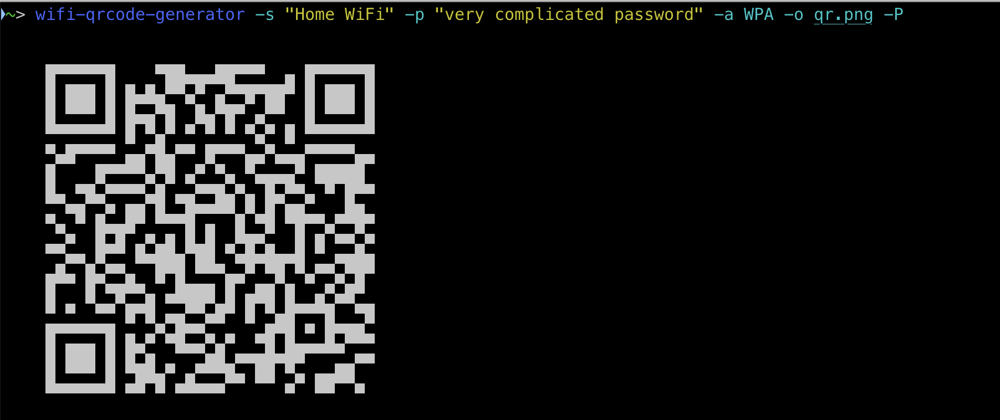

# wifi_qrcode_generator
Generate a QR code for your WiFi network to let others quickly connect without needing to tell them your long and complicated password.

## Installation
```bash
$ pip install wifi-qrcode-generator
```

## Usage
### CLI interactive mode
```bash
$ wifi-qrcode-generator
```


### CLI non-interactive mode
```bash
$ wifi-qrcode-generator -s "Home WiFi" -p "very complicated password" -a WPA -o qr.png -P
```


### Python API
```python
#!/usr/bin/env python3
import wifi_qrcode_generator.generator

qr_code = wifi_qrcode_generator.generator.wifi_qrcode(
    ssid='Home WiFi', hidden=False, authentication_type='WPA', password='very complicated password'
)
qr_code.print_ascii()
qr_code.make_image().save('qr.png')
```

## Dependencies
- [Pillow](https://pypi.org/project/Pillow/)
- [qrcode](https://pypi.org/project/qrcode/)
